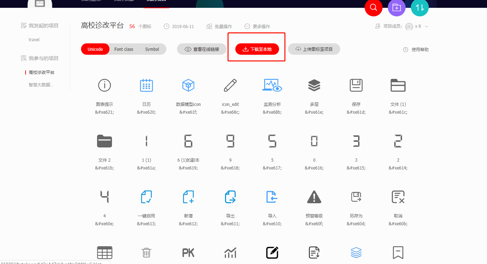
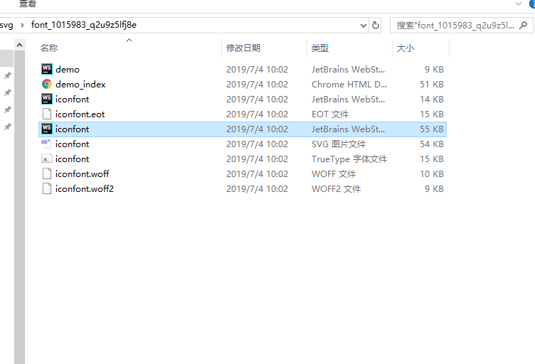

###把每天遇到的问题以及解决方法都写到这个里面
##### 2019-06-12
- 在a方法（promise）里面回调成功后再调用b方法，但是浏览器请求的顺序b在a前面，所以说这个有的时候做不得准，
先后顺序以断点或者打印的结果为准
- 在promise的then回调里面写逻辑因为未申明一个数组arr，但是却直接使用它push元素，程序这个时候回自动跳到promised的失败回调catch里面

##### 2019-06-13
- 使用了concat方法合并两个数组,合并后返回一个新的数组并不会对合并的数组arr1,arr2造成影响
如果都是一维数组的话就可以达到深拷贝的效果，如果是多维数组，比如下面这样
所以总结一下一维拷贝的是值（深拷贝），如果是多维的拷贝的是内存地址，所以不管是修改arr里面的多维部分，还是修改arr3
的多维部分，都会互相影响
```
    const arr1 = [3,5,5]
    const arr2 = [6,7,8]
    const arr3 = [[9,10,11],12]
    const arr = arr1.concat(arr2,arr3) 
    arr[6][0] = 10
    console.log(arr) // [3,5,5,6,7,8,[10,10,11],12]
    console.log(arr1) //[3,5,5]
    console.log(arr2) //[6,7,8]
    console.log(arr3) //[[10,10,11],12] //多维数组会被改变
```
- 理解了vue-cli3.0的proxy代理接口的意义及用法,下面代码是使用了nginx来达到跨域的目的
就是用/api来代替https://bot-test.dingtax.cn，如果target对应的value不是以'/'
结尾，那么pathRewrite里面的配置'^/api'对应的value就要是'/' ,如果target对应的value是以'/'结尾,
pathRewrite里面的配置'^/api'对应的value就要是''
```
    proxy: { //配置自动启动浏览器
                "/api": {
                    target: "https://bot-test.dingtax.cn",
                    changeOrigin: true,
                    // ws: true,//websocket支持
                    secure: false,
                    pathRewrite: {
                        '^/api': '/'    //代理的路径
                    }
                },
            }
```
- 测试Object.assign(obj1,obj2,...)
返回新对象也会污染原先的对象可以试用Object.assign({},obj1)来达到浅拷贝,
注意两个参数的位置不能颠倒，以为第一个参数是目标对象，第二个参数是源对象，
返回的是目标对象，即返回值和第一参数指向同一个内存空间
拷贝的只是内存地址，所以修改一个另一个也会改变
一般使用的时候可以Object.assign({},obj1,obj2...)
```
    const obj1 = {
          name: 'sj'
    }
    const obj2 = {
          age: 25
    }
    const newobj = Object.assign(obj1,obj2)
    console.log(newobj) //{name:'sj',age: 25}
    console.log(obj1) //{name:'sj',age: 25}

```
##### 2019-06-18
1.我们访问对象的某个属性通常不确定某个属性是否存在，尤其是深层嵌套的时候，要一级一级的去判断，让代码变得不好维护
现在有一款插件可以帮我们实现这个多级访问的问题不存在的话会直接返回undefind而不会报错，插件安装地址https://babeljs.io/docs/en/babel-plugin-proposal-optional-chaining
npm安装之后，在.babelrc（老版本）或者babel.config.js（新版本）中添加plugin

##### 2019-06-19
1.nuxt动态路由 即动态相加的路由应该写成这样:to="'/goods/detail/' + item.id"
##### 2019-06-20
1.css选择器之 +
```
     div + p {
        lineheight: 30px
     }   
    .inner + .inner {
        background: red
    }
```
- div后面的所有p元素
- 第一个.inner之后的所有.inner
##### 2019-06-21
1.::after用法
```
::after {
    content: url()
    content: '\260E'
    content： ''
}
```
- 伪元素添加了一个页面中没有的元素（只是从视觉效果上添加了，不是在文档树中添加），伪类是给页面中已经存在的元素添加一个类。
- 不占用Dom节点
- content可以是一个路径也可以是图标字体或者字符串
##### 2019-06/24
1.作用域在函数定义时就已经确定了。而不是在函数调用时确定
2.this是在调用时确定
```
 var x = 10
    function f() {
        console.log(x)
    }
    function show(fn) {
        var x = 20
        fn()
    }
    show(f)
```
##### 2019-06-25
1.str.match(reg) 返回匹配的值
```
    let str = 'zhuxinweizhuxinwei'
    let reg = /zhu/g  //正则表达式没如果传入的值不是正则会隐式的new
    let value = str.match(reg) // ["zhu", "zhu"]
```
2.str.replace(reg,value) 把str的reg替换成value
- 不会改变原有的数组
- 返回一个新的数组
```
    let str = 'zhuxinweizhuxinwei'
    let reg = /zhu/g  //正则表达式没如果传入的值不是正则会隐式的new
    let newstr = str.replace(reg,'fan') // 'fanxinweifanxinwei'

```

###### 2019-06-26
1.关于axios的使用问题 excel post导出
问题描述：原先用的是h5的a标签特性使用get请求（需要全路径），但是由于参数过多，和后端商量用post,下载excel
表格
遇到的问题，正常请求通过a标签的href属性也看到了后台返回的二进制数据，但是打开表格缺显示undefind
最后发现是需要在请求的时候配置responseType: 'blob'，不然返回的二进制文档流不会被解析
```
//在常规的post请求后面加上一个config对象配置
export const exportd = (url, params, config, callback, errorback, falseback) => {
  return axios.post(`${base}` + url, params, config)
    .then((res) => {
      if (res && callback) { callback(res.data, res) }
      if (!res) {
        falseback()
      }
    })
    .catch((error) => {
      if (errorback) { errorback(error) } else { console.log(error); console.log(error.response + qs.stringify(params)) }
    })
}
// config = {responseType: 'blob'}
 exportd('/bot-admin/api/leaveMessage/down', Object.assign(params), {responseType: 'blob'}, (res) => {
         
          let url = window.URL.createObjectURL(new Blob([res], {type: 'application/vnd.ms-excel'})); // 处理文档流
          let link = document.createElement('a');
          link.style.display = 'none';
          link.href = url;
          link.download = '留言列表.xls';
          document.body.appendChild(link);
          link.click();
          document.body.removeChild(link);
        })
```
2.关于422报错问题
证明接口已经通了，但是可能请求的方式不对
- 比如后台是post接口，前端发送请求的时候是get
- 或者是请求的参数有问题，这个需要联合后台去查，比如传参的格式（是否序列化）
- 比如需要你传的某个字段是数组传成了字符串
- 或者空值情况的传递问题
##### 2019-06-27
1.js array
- arr.indexof(value)的用法  返回value元素在arr中的下标，不存在返回-1

2.vue computed watch
- computed的作用是根据别的东西来计算一个值,是被别的值触发；
  - watch的作用是监听自身的变化来触发别的
  - computed是根据别的值改变自己
```
    computed () {
        return this.num1 + this.num2
    }
```
3.工具篇
- 购买了一个webstrom的永久破解码
- debugger失效的问题
    - 需要在浏览器安装JetBrains IDE Support，在扩展程序选项里调整接口
    - 看webstrom里plugins的installed选项里是否有javascript debugger,正常都是会自动安装的，除非你取消了，那就需要重新下载
    - 查看settings -> debugger port端口是否与JetBrains IDE Support设置的端口一致
    - 启动程序比如vue，左上角切换到dev或者是server
    - 在要使用断点的地方敲debugger命令
    - 在浏览器上触发事件就可以正常使用了
##### 2019-06-28
1.思路问题一个简单二十分钟能搞定的问题，花了一个半小时，思考的方向错误
- 遍历的东西同一个元素即使背景图片不同也不能使用两个元素，应该是通过遍历数组的下标能判定，添加不同的class
- 不同元素添加出来的id一定不能一样，因为好多人都会以id区分同一个数组的不同元素
2.v-viewer插件，可以放大图片支持鼠标缩放，支持图片切换
##### 2019-07-01
1.解构：等号两边的模式相同，左边的变量就会被赋予对应的值 
- 模式相同可以粗狂的理解为类型相同，但是这句话肯定是不完全对的，后面再说
- 数组解构
```
1.成功解构 普通解构，嵌套解构，不完全解构，默认结构
//普通解构
let [a, b, c] = [1, 2, 3];    a // 1, b // 2,  c // 3
let [head, ...tail] = [1, 2, 3, 4]; head // 1,tail // [2, 3, 4]
//嵌套解构
let [a,[[b],c]] = [1,[[2],3]] a // 1, b // 2,  c // 3
// 不完全解构 类似于不成功解构，没被解构的值为undefind
let [a,[[],c]] = [1,[[2],3]] a // 1, c // 3, b // undefind
// 默认结构  只有严格等于undefind才会被默认机构（为null不会被默认解构）
let [a, b=4] = [1] a = 1, b = 4
let [a = 1,b] = [undefind, 4] a = 1, b = 4
2.错误解构
let [foo] = 1;
let [foo] = false;
let [foo] = NaN;
let [foo] = undefined;
let [foo] = null;
let [foo] = {};
```
2.vue相关--watch与computed那个先执行
computed执行完之后，watch才会执行

3.js Array splice,像数组中添加和删除元素，然后返回被删除元素，会改变原数组
- 第一个参数是数组的下标，第二个参数是要删除的个数，后面的参数都是新增
- 如果只有一个参数，那么就从当前下标开始删到最后（包括当前下标元素）
- splice函数会返回一个数组，里面是被删除的元素
```
    const arr = ['admin', 'xiaoming', 'xiaohong', 'xiaomei']
    const newArr = arr.splice(3, 1, '小淘气')
    console.log(arr) //['admin', 'xiaoming', 'xiaohong', '小淘气']
    console.log(newArr) // ["xiaomei"]
```
##### 2019-07-02
1.跳出多重循环后继续执行下一次循环 使用标记语句
- continue是跳出当前循环，继续执行下一次循环，一般配合if使用
- 标记语句是跳出多重循环，继续执行下一次循环 使用一个变量标记一下，然后if的时候continue + 标记
```
firstLoop: 
for (let i = 0; i < 3; i++) { 
   for (let j = 0; j < 3; j++) {
      if (i === j) {
         continue firstLoop; // 继续 firstLoop 循环
         // break firstLoop; // 中止 firstLoop 循环
      }
      console.log(`i = ${i}, j = ${j}`);
   }
}
// 输出
i = 1, j = 0
i = 2, j = 0
i = 2, j = 1
```
2.利用a标签来解析一个url,可以快速的帮我们返回端口参数等一系列的东西，而不需要我们自己费劲的去截取
```
function parseURL(url) {
    var a =  document.createElement('a');
    a.href = url;
    return {
        host: a.hostname,
        port: a.port,
        query: a.search,
        params: (function(){
            var ret = {},
                seg = a.search.replace(/^\?/,'').split('&'),
                len = seg.length, i = 0, s;
            for (;i<len;i++) {
                if (!seg[i]) { continue; }
                s = seg[i].split('=');
                ret[s[0]] = s[1];
            }
            return ret;
        })(),
        hash: a.hash.replace('#','')
    };
}

```
##### 2019-07-02
1.遇到一个有意思的问题，我有一个值通过computed从store(vuex)获取的，然后再mounted调用方法
发送请求用到了这个值作为参数，结果debugger下来发现mounted会先执行然后再执行computed
的值，所以这个值恒为空，出现查的数据不对，因为这个是子组件，所以有三个方法解决这个问题
- 通过父组件传递--props
- 不使用computed直接在mounted/created里获取这个值
- 或者使用watch监听数据变化后发送请求，并设置immediate: true页面初始化执行一次
2.js Array reduce
- reduce可以接受两个参数
- 第一个参数是一个callback函数，接受四个值
- callback的第一个值（取名firstChild）取决于reduce的第二个参数(value)，如果存在第二个参数value，那么firstChild就等于value,否则firstChild
就等于数组的第一个元素
- callback函数的第二个值currentValue表示当前值，也取决于value,如果value有值就从下标0开始，value不传就从下标1开始
- callback函数的第三个第四个分别是index下标和arr原数组
```
const arr = [1,2,3,4,5]
            let result = arr.reduce((firstChild, currentValue, index, arr)=>{
                return firstChild + currentValue
            },6)
            console.log(result)
```
3.调试代码的心得
- 看借口，返回的东西，状态码
- 调试的时候发现错误如果有几种解决方案可以系统的想一遍，或者那笔画一画对比一下
- 不能仅凭臆想去猜测
4.防止浏览器跳转刷新后会清除掉network之前的接口
- preserve log勾上就可以了
##### 2019-07-03
1. JS array map
- 需要return关键字返回一个新数组
- 不会修改原数组，这句话应该理解为不会修改栈内存存储的东西
因为数组里面就是单个的数字或字符串什么的，就不会改变
如果是对象的话，对象指向的内存地址不会改变，内存地址对应的值是会被改变的
- 如果数组元素是引用类型，不需要return也不需要变量接受返回值，也会对原数组进行修改

```
    const arr = [{name: 'zs'},{name: 'ls'}]
    const newArr = arr.map((item) => {
       item.age = 23
       return item
    })
    console.log(newArr) // [{name: "zs", age: 23}, {name: "ls", age: 23}]
    console.log(arr) // [{name: "zs", age: 23}, {name: "ls", age: 23}]
    console.log(arr === newArr) //虽然值完全相等，但是他们指向不同的内存地址，所以是不相等的
```
2.vue keep-alive
- 缓存组件，缓存过得组件生命周期内的都行不会再次被执行，从新进入这个页面会缓存第一次进来的东西
- include，exclude表示那些组件需要缓存那些不需要缓存（可以通过组件的名字，在组件上加上is='组件名'），二者都可以用逗号分隔字符串、正则表达式或一个数组来表示：
- vue2.0支持通过路由来配置 meta: {keepAlive: true/false},然后直接v-if来判断
- activated,deactivated这两个生命周期函数需要搭配keep-alive组件生效，activated表示
再次进入被缓存组件时触发，另一表示离开时触发
一个表示
```
<keep-alive include="test-keep-alive">
  <component></component>
</keep-alive>

// vue2.0路由
 {
      path: '/',
      name: 'Home',
      component: Home ,
      meta: {
        keepAlive: true // 需要被缓存
      }
    }
    
 <template>
   <div id="app">
     <keep-alive>
       <router-view v-if="$route.meta.keepAlive"></router-view>
     </keep-alive>
     <router-view v-if="!$route.meta.keepAlive"></router-view>
   </div>
 </template>  
```
##### 2019-07-04
1.微信小程序第一天
- 拉取了github上的最火的微信小程序
- 开了微信小程序文档
- 通过github上的方法搭建了域名 telphone 621901（个性域名zxw）
- 微信小程序搭建了域名开发-开发设置，服务器域名添加了域名	
https://api.it120.cc 
- 本地请求https://api.it120.cc/zxw/ + url
- 已调试通
2.本地配置了svgicon通过阿里的fonticon
- 下载到本地

- 拷贝到项目 可以在assets下新建一个文件夹放进去
 
 - main.js全局引用
 ```
 import Iconsvg from './components/common/IconSvg'
```
- 封装成组件 在components下新建common文件夹，在common新建IconSvg.vue
```
<template>
    <svg class="svg-icon" aria-hidden="true" @click="svgClick($event)">
        <use :xlink:href="iconName"></use>
        </svg>
        </template>

        <script>
    export default {
        name: 'icon-svg',
        props: {
            iconClass: {
                type: String,
                required: true
            }
        },
        computed: {
            iconName() {
                return `#${this.iconClass}`
            }
        },
        methods: {
            svgClick(e) {
                this.$emit('parengSvgClick', e)
            }
        }
    }
</script>

<style>
    .svg-icon {
        width: 1em;
        height: 1em;
        font-size: 18px;
        vertical-align: -0.15em;
        fill: currentColor;
        overflow: hidden;
    }
</style>
```
- 在main.js注册成全局组件
```
Vue.component('icon-svg', Iconsvg) //注册为全局组件
```
- 使用 iconClass的名字可以在下载的文件iconfont.css找到
```
 <icon-svg iconClass="icon-bianji"></icon-svg>
```
##### 2019-07-05
1.作业 transfrom与translate,translation的区别
- transfrom 变形渐变，translate是其中的一个方法
- translate依据x,y轴移动当前元素
- transition 需要事件的触发，在一定时间内平滑过渡

##### 2019-07-08
1.从浏览器输入网址到渲染的天龙八步
- 客户端输入域名后会先从本地的host文件，去确认你对应的域名的ip,将域名解析成对应的ip是DNS完成的
   - 浏览器客户端像本地dns服务器发送你输入的域名的dns查询报文
   - 本地dns服务器把查询报文转发到根dns服务器，根dns服务器根据后缀是.com/.cn/...返回对应的comDNS/cnDNS服务器的ip地址
   - 本地dns服务器再次像comDNS/cnDNS服务器发送查询请求，comDNS/cnDNS服务器注意到发送请求域名的后缀是com/cn并用该域名负责的权威DNS服务器的ip地址作为回应
   - 最后本地DNS服务器将含有本地发送请求的域名的ip地址的相应报文发送给客户端
   - 正常情况下本地的DNS服务器缓存中已有输入连接的域名，那么请求根域名服务器这一步不是必需的
   
- 拿到服务器ip后，就需要链接到该服务器，客户端和pc端进行TCP连接，就是三次握手
  - 请求连接（SYN数据包）
  - 确认信息（SYN/ACK数据包）
  - 握手结束（ACK数据包）
- 建立连接后，发送HTTP请求
- 服务器处理HTTP请求，并返回结果
- 浏览器解析并执行生成dom，cssom树
- 四次挥手
  - 在发出请求之后，浏览器会发出FIN请求，请求关闭连接
  - 服务端这个时候，可能还在传输数据，所以只能先暂时给客户端一个收到关闭连接请求的回复
  - 等数据真正传送完之后，服务端才能发送FIN报文
  - 当客户端收到服务端的FIN报文后会再次请求确认，这个时候服务端连接会立即关闭，然后客户端也会关闭连接    
##### 2019-07-15
1.v-slot的用法
 - 默认插槽，一般封装的组件里面只有一个插槽的话 可以使用默认插槽
 ```
    // 子组件 child.vue
    <template>
       <div>
          <slot>我是默认插槽</slot>  
       </div>
    </template>
    // 父组件
    <template>
        <div>
          <child></child>
        </div>
    </template>
    <script>
        import child from './child'
        export default {
          components: {
            child
          }
        }
    </script>
 ```
 - 具名插槽子组件通过name属性命名，父组件通过v-slot来建立连接
 
```
// child.vue
<template>
    <div>
        <slot name="test">
            我是默认选项
        </slot>
        <slot>默认插槽</slot>
    </div>
</template>
```
// parent.vue
```
<template>
    <div>
        测试页面
        <test-slot v-slot="test">
          
        </test-slot>
    </div>
</template>
```
- 多个具名插件传值 子组件通过name命名通过v-bind绑定数据，父组件通过v-slot:name="{绑定的名字}"来建立连接
  ex: v-slot:test = '{user}' v-slot的别名是#所以可以简写成 #test= '{user}'
// child.vue
```
    <template>
        <div>
            <slot name="test" :user="user">
                我是默认选项
            </slot>
            <slot>默认插槽</slot>
        </div>
    </template>
    
    <script>
        export default {
            name: "TestSlot",
            data() {
                return {
                    user: {
                        name: 'zxw',
                        age: 26
                    }
                }
            }
        }
    </script>
```
// parent.vue
```
<template>
    <div>
        测试页面
        <test-slot>
            <template v-slot:test="{user}">
                <div>{{user.name}}</div>
                <div>{{user.age}}</div>
            </template>
        </test-slot>
    </div>
</template>

<script>
    import testSlot from './slot'
    export default {
        name: "test",
        data() {
            return {}
        },
        components: {
            testSlot
        }
    }
</script>
```      
  
  ##### 2019-07-16
  1.路由的导航守卫
   - 全局守卫（需要写到main.js或者把js文件引入到main.js）
   //前置守卫
   ```
   /*
   * to 要进入的路由
   * from 从那个路由离开
   * next 是否显示下一个路由
   */
   router.beforeEach((to,from,next)=>{
  if(to.path == '/login' || to.path == '/register'){
    next();
  }else{
    alert('您还没有登录，请先登录');
    next('/login');
  }
})
```
//后置守卫
```
router.afterEach((to,from)=>{
  alert("after each");
})
```

- 组件内的守卫 这里面的to,form与全局一致，区别在于next
```
// 如果直接在前置路由里面访问data里面的数据是访问不到的，因为生命周期的关系，如果需要访问data里面的数据需要用next里面的回调
export default {
    data(){
        return{
            name:"Arya"
        }
    },
    //进入组件
    beforeRouteEnter:(to,from,next)=>{
        next(vm=>{
            alert("hello" + vm.name);
        })
    },
    //离开组件
    // 点击其他组件时，判断是否确认离开。确认执行next()；取消执行next(false)，留在当前页面。
    beforeRouteLeave:(to,from,next)=>{
        if(confirm("确定离开此页面吗？") == true){
            next();
        }else{
            next(false);
        }
    }
}
```
-路由独享守卫
```
const route = [
 {
  path: '',
  name: '',
  component: '',
  beforeEnter: (to,form,next) => {
  
  }
 }
]
```
2.扩展运算符
 - 函数调用使用扩展运算符
 
  ...arr返回的并不是一个数组，而是各个数组的值。只有[...arr]才是一个数组，所以...arr可以用来对方法进行传值
 ```
  function myFunction(x, y, z) { 
    console.log(x+""+y+""+z); 
  } 
  
  var args = [0, 1, 2]; 
  myFunction(...args);
 ```
 - 数组和对象的拷贝,浅拷贝
 ```
  //数组拷贝
  const arr = [1,2,3]
  const list = [4,5,6]
  const arr1 = [7,8,9]
  const newArr = [...arr,...list,...arr1] //[1,2,3,4,5,6,7,8,9]
  // 对象拷贝
  const name = {name: 'zs'}
  const age = {age: 25}
  const sex = {sex: 'gril'}
  const obj = {
      ...name,
      ...age,
      ...sex
  }
  console.log(obj) // {name: "zs", age: 25, sex: "gril"}
 ```
 - 字符串转数组
 ```
   let str = 'helloworld'
   const arr = [...str]
   console.log(arr) //["h", "e", "l", "l", "o", "w", "o", "r", "l", "d"]
 ```
#####2019-07-25
1.vuecli结合ts使用，现在装监视器vue-property-decorator，对比传统的vuecli改变
- script和data写法的不同
```
<script lang="ts">
 import {Vue, Component} from 'vue-property-decorator';
 @Component
 expeort default class 当前组件名 extends Vue {
  //传统的data已经没有了，改成了,直接声明的方式，但是不需要var,let,const
        ValA: string = "helloworld";
        ValB: number = 1;
 }
</script>
```
- computed的不同 只需要在计算属性加一个get关键字就好了，用法还是一样的
```
<script lang="ts">
 import {Vue, Component} from 'vue-property-decorator';
 @Component
 expeort default class 当前组件名 extends Vue {
   get ValA(): number{
            return 1;
        }
 }
</script>
```
- $emit写法的不同，之前是一个方法里面直接写,@Emit会把注解的方法，tuofeng 转化为-连接的写法
```
// 正常的写法
emittodo() {
 this.$emit('item-todo',param)
}
// ts写法
@Emit
emitTodo(n: any){
//dosomething
}
//使用的时候
this.$on('emit-todo',()=> {})

//或者我们给定一个事件名字
@Emit('reset')
doSomething(param) {

}
this.$on('reset',(value) =>{})
```
- watch写法的改变
```
//正常写法
 watch: {
        'child': this.onChangeValue
            // 这种写法默认 `immediate`和`deep`为`false`
        ,
        'person': {
            handler: 'onChangeValue',
            immediate: true,
            deep: true
        }
    },
    methods: {
        onChangeValue(newVal, oldVal){
            // todo...
        }
    }
   // ts写法
   @watch('person', {immediate: true,deep: true}) 
   onChangeValue(newVal, oldVal){
            // todo...
        }
```
- prop写法的不同
```
//常规写法
props: {
    propA: {
      type: Number
    },
    propB: {
      default: 'default value'
    },
    propC: {
      type: [String, Boolean]
    },
  }
  // ts写法
  @Prop(Number) propA!: number;
  @Prop({default: 'default value'}) propB!: string;
  @propC([String, Boolean]) propC: string | boolean;
```
##### 2019-07-26
ts踩坑实录
- 组件创建方式坑点
```
 // ts的class name必须大驼峰命名
 export default class LayoutHeader extends Vue {
   
 }
```
- 组件的引入
```
 //第一个坑点 1.import引入组件名的时候必须加上.vue后缀 
 import header form './Header.vue'
 //第二个坑点 2.引入的方式
 @Component({
  components: {
    header
  }
 })
```
- ts文件踩坑

需要在ts文件的最后一行再打一个空行

##### 2019-08-05
1.iframe的用法
```
// 基本用法 如果是get类型的直接把参数坠到后面 `url?param1=${param1}&param2=${param2}`
<iframe src='' width='600px' height= '70%' id='' class='' frameborder='0'></iframe>
```
```
// 进阶用法 如果参数过多需要使用post请求就需要借用form表单传值
//只需要把之前的src赋值给action并且 让form的target和iframe的name值保持一致
<form action='' ref='form' target='target1' method='post'>
  <input type='hidden' name='data' value='' ref='input'></input>
</form>
<iframe  width='600px' height= '70%' id='' class='' frameborder='0' name='target1'></iframe>

function clickPrint() {
    let form = this.$refs.form
    let input = this.$refs.input
    form.setAttribute('action', url)
    input.setAttribute('value', param)
    form.submit()
}
```
##### 2019-08-07
1.element 菜单栏展开
需要在el-menu-item或者el-submenu上添加:index='str',然后在el-menu上添加:default-open=['str']
2.git问题汇总
git reset --hard返回上一级更新
拉分支成功之后需要把，代码push到服务器上
git checkout master
git pull
git checkout -b dev1.0
//稍等一会会发现分支会自动切换到dev1.0
git push origin dev1.0
git push --set-upstream origin dev1.0
//修改了的东西要提交，不然你切回master的时候会发现，分支上修改的东西在master上生效了
用webstrom提交的时候需要注意一下，push的时候看看提交的分支是不是对应远程的新分支
如果不是的话 需要执行命令
git branch --set-upstream-to=origin/分支名称
3.递归浏览器不解析问题
左边栏使用递归来写的，但是出现了浏览器不解析的问题，解决方法就是使用注册成全局组件
import child form './child'
Vue.component('child',child)
使用的话就直接使用<child></child>,不需要再引入
4.脚手架ie浏览器白屏问题，需要安装'babel-polyfill'
安装之后还是不行的话就考虑，是不是vue.config.js里面的配置项有问题，我这次是css配置出现了问题，多配置了一个extract： true,注释掉这个就好了
5.vue在新标签页打开页面
```
// target参数需要定义成_blank, 有几个参数就有几个input,input的name就是参数的字段
<form action='' ref='form' target='_blank' method='post'>
  <input type='hidden' name='data' value='' ref='input'></input>
</form>
function clickPrint() {
    let form = this.$refs.form
    let input = this.$refs.input
    form.setAttribute('action', url)
    input.setAttribute('value', param)
    form.submit()
}
```


##### 2019-08-08
1.Vue 弹窗第二次获取焦点失效的问题
原因是获取到焦点的时候，dom元素可能还没有加载完，所以需要使用
```
this.$nextTick(()=>{

})
```
2.Element UI table
如果如要后端返回的数据是scope.row[col],操作列相关的东西用item.value

3. 表格的点击显示input输入框
```
// 定义列的字段的时候 给可以编辑的列添加一个表示 ex: {label: '销量', keyVal:'saleNumber', type: 'input'}
//遍历字段时  给cell里面的span添加一个事件，定义一个变量，控制显示隐藏开关
<el-table-column v-for="item in col" :label='item.label' :prop='item.prop' :key='item.prop'>
    <template slot-scope='scope'>
        <span v-if='!item.type'>{{scope.row[item.keyVal]}}</span>
        <div v-else>
            <el-input @blur="scope.row[item.keyVal + 'isshow'] === undefind" v-model="scope.row[item.keyVal]"
               v-show="scope.row[item.keyVal + 'isshow']" :placeholder='scope.row[item.keyVal]'>
               </el-input>
            <span class='neewEdit' @click="scope.row[item.keyVal + 'isshow'] = true"
                   v-show="scope.row[item.keyVal + 'isshow']  === undefind">
                   {{scope.row[item.keyVal]}}
            </span>
            
        </div>
    </template>
</el-table-column>

```

4.Vue filter用法
```
   // 在常规脚手架的使用
   1.全局的
   Vue.filter(name, function(){})
   2.局部的使用
   export default {
        data(){}
          filters: {
      /* 格式化时间戳 */
      formatDate (val) {
        const date = new Date(val);
        const year = date.getFullYear();
        const month = date.getMonth() > 9 ? date.getMonth() + 1 : `0${date.getMonth() + 1}`;
        const day = date.getDate() > 9 ? date.getDate() + 1 : `0${date.getDate() + 1}`;
        return `${year}-${month}-${day}`;
        console.log(val);
      }
   }
   }
   // 在dom元素里使用 方法的第一个参数默认就是通道前面的值
   <div>{{1556466784645 | formatDate}}</div>
   
   // 在ts脚手架使用过滤器
   import { numberFormat } form '@/common/filters'
   @Component({
     filters: {
        numberFormat       
     }
   })
   export default class CTable extends Vue {
    
   }
```

##### 2019-08-12
1. elementUI 选择开始时间后，如何再控制结束时间的选择范围
```
<!DOCTYPE html>
<html lang="en">
<head>
    <meta charset="UTF-8">
    <title>element-ui 关于日期范围选择控件，如何限制只能选择30天</title>
    <!-- 引入样式 -->
    <link rel="stylesheet" href="https://unpkg.com/element-ui/lib/theme-chalk/index.css">
</head>
<body>
<div>
    <div id="app">
        <el-date-picker
                v-model="dateRange"
                :picker-options="pickerOptions"
                type="daterange"
                range-separator="至"
                start-placeholder="开始日期"
                end-placeholder="结束日期">
        </el-date-picker>
    </div>
</div>
</body>
<!-- import Vue before Element -->
<script src="https://unpkg.com/vue/dist/vue.js"></script>
<!-- import JavaScript -->
<script src="https://unpkg.com/element-ui/lib/index.js"></script>
<script>
  new Vue({
    el: '#app',
    data: function() {
      return {
        pickerMinDate: '',
        dateRange: [],
        pickerOptions: {
          onPick: ({ maxDate, minDate }) => {
            this.pickerMinDate = minDate.getTime()
            if (maxDate) {
              this.pickerMinDate = ''
            }
          },
          disabledDate: (time) => {
            if (this.pickerMinDate !== '') {
              const day30 = (30 - 1) * 24 * 3600 * 1000
              let maxTime = this.pickerMinDate + day30
              if (maxTime > new Date()) {
                maxTime = new Date()
              }
              return time.getTime() > maxTime
            }
            return time.getTime() > Date.now()
          }
        }
      }
    }
  })
</script>
</html>
```

##### 2019-08-23

1.事件的执行顺序
先捕获，自己，再冒泡

2.vue 操作dom节点，先从上往下捕获，如果想要获取指定的节点需要在节点上添加事件，然后通过ev.currentTarget获取当前的节点
target会获取当前点击的元素

3.vue里监听是否发生了事件
```
 window.addEventListener("click", ()=> {});

```

##### 2019-09-16
1.element ui上传附件 路径问题，之前写的全路径但是有的时候会出现跨域问题，这个很诡异第一次用这个组件出现跨域问题，刚好因为这个问题让我搞明白了一个事情，我就是不写全路径上传也是会走我们在vue.config.js配置的nginx配置的路径
2.用[...new set(arr)]的时候，我们需要用一个变量来接收
3.event兼容性问题，ie浏览器是有兼容性问题的，
4.HTMLCollection问题获取不到节点，但是在浏览器上看到的是有一个元素的，但是读取不出来，其实是因为我们用的element ui当我们来获取的时候，我们正在像后台请求数据，页面还没有来的及渲染，所以获取不到节点 我们在请求之后的finally里面再来获取就可以了
5.content-type设置

##### 2019-09-29
1.下载附件 new Blob()不确定类型下载，需要后台返回文件的名字（带上后缀），type只需要给一个空串，再给下载的a标签a.download = 文件名，就可以在不规定文件类型的情况下正常下载任何文件（Ie有兼容性问题）

2.element表格分组 

tableData里面的每个对象都需要添加一个rowid，然后在table上挂载row-key，特别需要注意的是rowid要从1开始

3.表格全选全不选的正常情况按照文档上来就好，如果是分过组的数据带的有children的，需要把children里面的数据也遍历点，然后再使用toggleRowSelection（child, true）

4.前端静态资源下载的问题，在vue-cli3脚手架里，把文件放到public里面，然后直接使用window.open(服务器域名 + 前端静态资源放置的文件 + 文件名)

5.在ts里面使用 async await ,
```
 public async fun() {
    await promise 
}

fun.then()
```
6. upload上传的 附件的过滤，before-upload, 如果renturn true就会继续上传，如果是false就不会再上传

